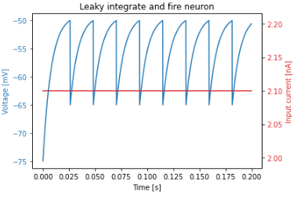

# Spiking neural networks using JAX

I've written simulations of a Leaky Integrate and Fire Neuron in *Plowman's* (pure) Python, Python + numpy, and 
Python + JAX.

Here's a plot of a 2000-step simulation for a single neuron:

The speedups using Jax and the JAX jit compiler are dramatic.

Pure Python can simulate a single step for a single neuron in roughly 0.25 µs. so *1,000,000 neurons* would take 
about **0.25 seconds**.

numpy can simulate a single step *for 1,000,000 neurons* in **13.7 ms**.

Python, JAX + jit compilation can simulate a single step *for 1,000,000 neurons* in **75 µs.**

All the timings were run on an Intel® Core™ i5-10400F CPU @ 2.90GHz with 15.6 GiB of RAM and a NVIDIA GeForce RTX 
3060/PCIe/SSE2 running Linux Mint 20.2, JAX 0.2.25 and jaxlib 0.1.73 with CUDA 11 and CUDANN 8.2.

I have successfully run the code on a Jetson Nano 4 Gb.

I've given links to the Nano installation [here](JAX-on-NANO.md),
and added the Nano notebook page with timings as `notebooks/`

Nano Timings are naturally slower than on my workstation

The project is on hold at present, but I plan to extend it to model synapses and start to explore more complex network 
architectures.

